# 📝 Notes API

Projeto de estudos criado com Laravel, Vue 3, Vuetify e Inertia.js para gerenciamento de anotações e grupos. A proposta deste projeto é praticar conceitos de desenvolvimento Full Stack, criação e consumo de APIs REST, integração entre Laravel e Vue.js, paginação, filtros, Soft Delete, relacionamentos entre entidades e boas práticas de organização de código.

---

## 🚀 Tecnologias e Recursos

### Stack

PHP 8.3+ • Laravel 10 • PostgreSQL 15 • Nginx • Docker • Vue.js 3 • Vuetify 3 • Inertia.js • Vite • Axios • Day.js • Font Awesome

### Conceitos Praticados

APIs REST • CRUD Completo • Soft Delete • API Resources • Laravel Actions • Relacionamentos Eloquent • Paginação • Filtros de Pesquisa • SPA com Vue.js + Inertia.js

---
## 🐳 Arquidetura Docker

```bash
├── docker/
│   └── nginx/
│       └── default.conf        # Configuração do servidor web (Nginx)
├── docker-compose.yml          # Orquestração dos containers
├── Dockerfile                  # Build do container PHP (Laravel)

# arquivo docker-compose.yml
├── note_app                    # Container PHP (Laravel Runtime)
│   ├── PHP 8.3                 # Runtime da aplicação Laravel
│   ├── Composer                # Gerenciador de dependências PHP
│   ├── Node.js                 # Runtime JavaScript
│   ├── Npm                     # Gerenciador de pacotes
│   └── Vite                    # Dev server + build assets (Vue/Inertia)
│
├── note_nginx                  # Servidor Web
│   └── Nginx

# projeto apenas pro banco
└── docker_data/
    └── postgres/               # Volume do banco de dados
```
---

## 🖥️ Tela de Anotações Web

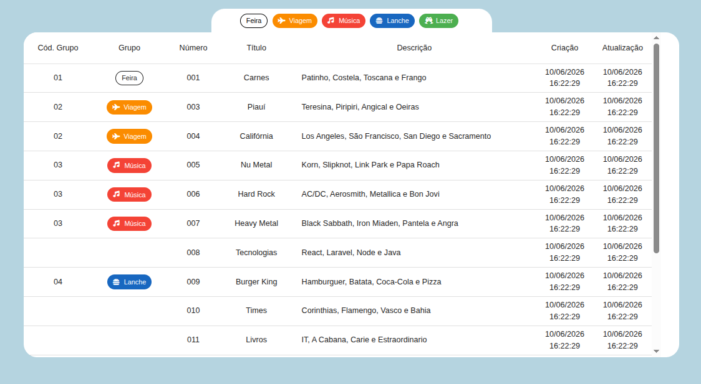

---

## 🔗 Endpoints da API

| Método | Endpoint | Descrição |
|----------|----------|----------|
| GET | `/api/notes` | Lista todas as anotações |
| GET | `/api/notes/{id}` | Retorna uma anotação |
| GET | `/api/notes/search` | Pesquisa anotações |
| POST | `/api/notes` | Cria uma anotação |
| PUT | `/api/notes/{id}` | Atualiza uma anotação |
| DELETE | `/api/notes/{id}` | Exclui uma anotação (Soft Delete) |
| GET | `/api/notes/trash` | Lista anotações excluídas |
| POST | `/api/notes/{id}/restore` | Restaura anotação excluída |
| DELETE | `/api/notes/{id}/force` | Remove permanentemente |
| DELETE | `/api/notes` | Remove múltiplas anotações |
| GET | `/api/notes/stats` | Retorna estatísticas |

---

## 📡 Exemplos de Uso da API

### Listagem de Anotações

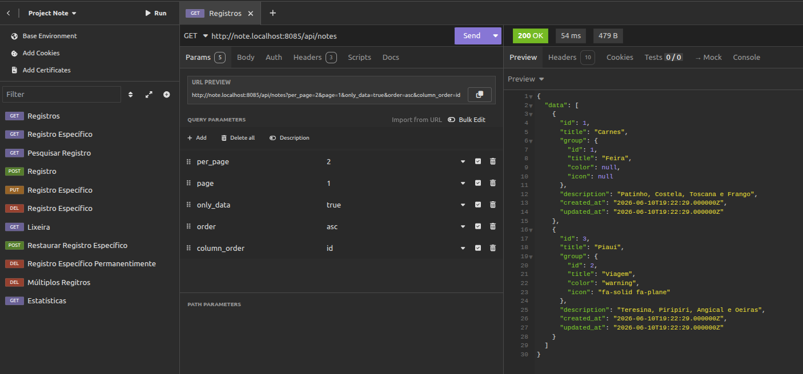

### Buscar Anotação por ID

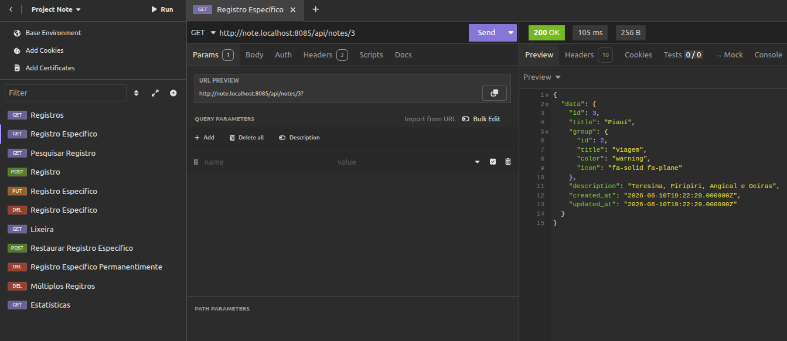

### Buscar Anotações

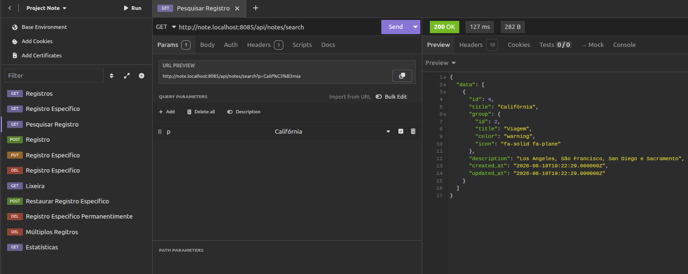

### Criar Anotação

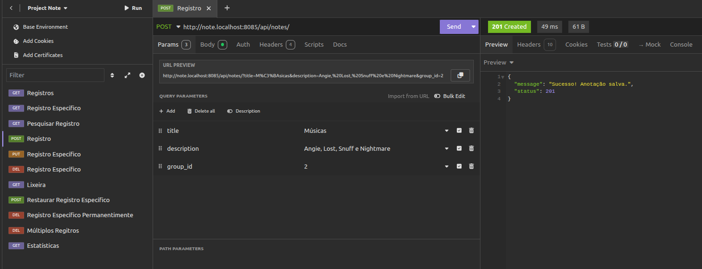

### Atualizar Anotação

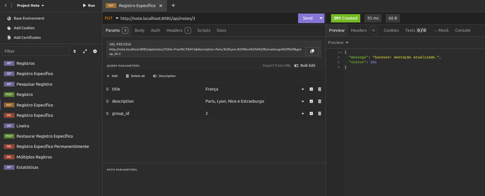

### Excluir Anotação (Soft Delete)

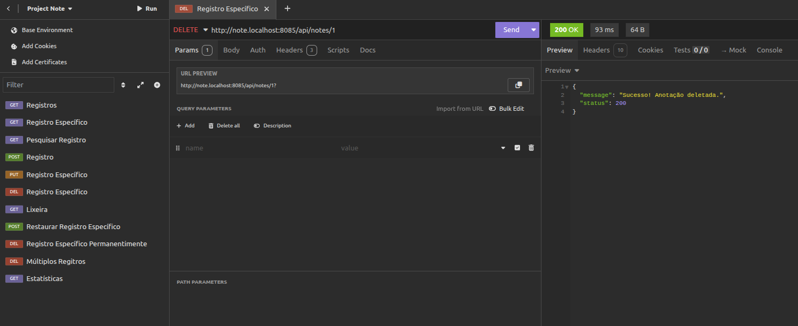

### Listar Anotações Excluídas

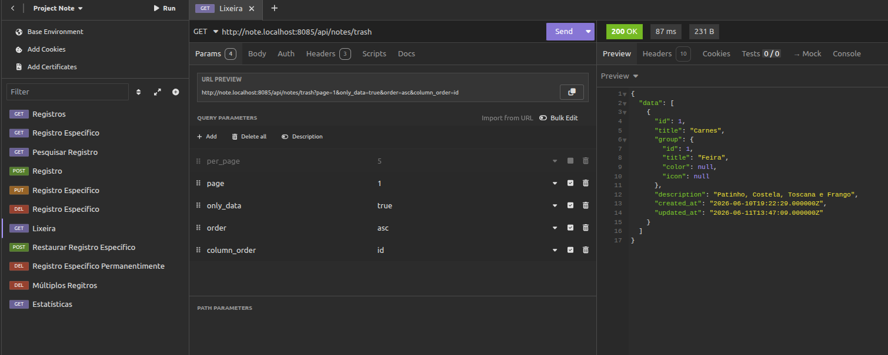

### Restaurar Anotação

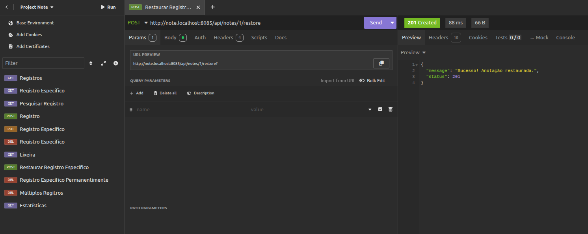

### Excluir Permanentemente

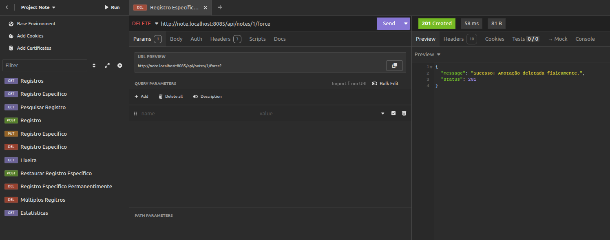

### Excluir Múltiplas Anotações

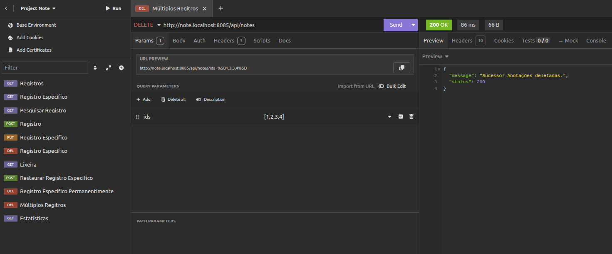

### Estatísticas

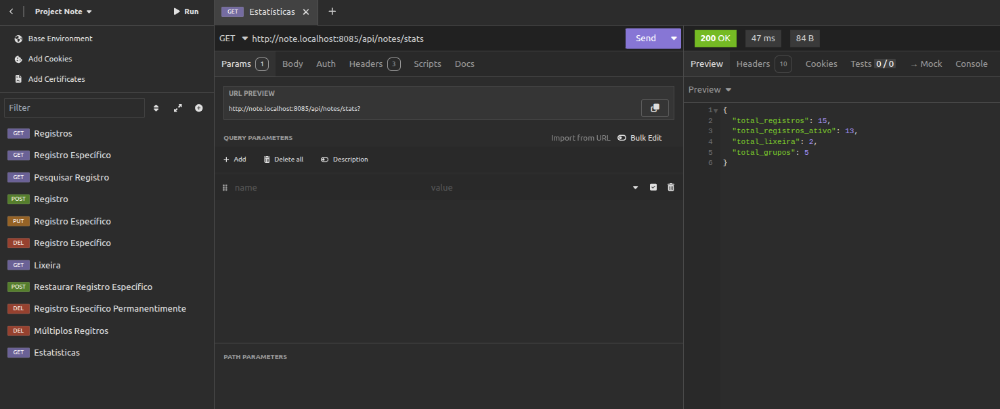

---

## ⚙️ Instalação

```bash
# Clone o projeto
git clone <url-do-repositorio>

# Entre na pasta
cd project-notes

# Instale as dependências do Laravel
composer install

# Copie o arquivo de ambiente
cp .env.example .env

# Gere a chave da aplicação
php artisan key:generate

# Execute as migrations e seeders
php artisan migrate --seed

# Instale as dependências do Front-end
npm install

# Inicie o ambiente de desenvolvimento
npm run dev

# Gerar build de produção
npm run build